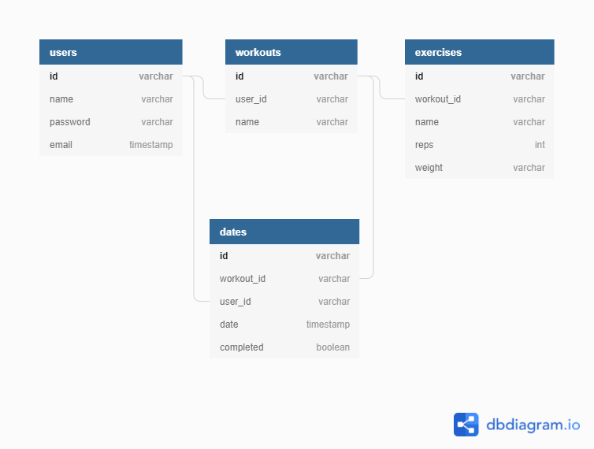

# DevMuscles

A workout planner for create and scheduling fully customised workouts.

Created by [Akash](https://github.com/akashkhambay) [Jawwad](https://github.com/JawwadUddin) and [Max](https://github.com/Velocima)

## Planning

[Source of Truth](./source_of_truth.md)

[Wireframe](https://excalidraw.com/#json=6091811160326144,swiN-1QPDIyG6nwApxTF4A)

**Database Schema**

## Changelog

The full changelog can be found [here](./changelog.md)

## bugs

If you find a bug and would like to report it, please [submit an issue](https://github.com/I-Ate-Sum-Pi/DevMuscles/issues)
